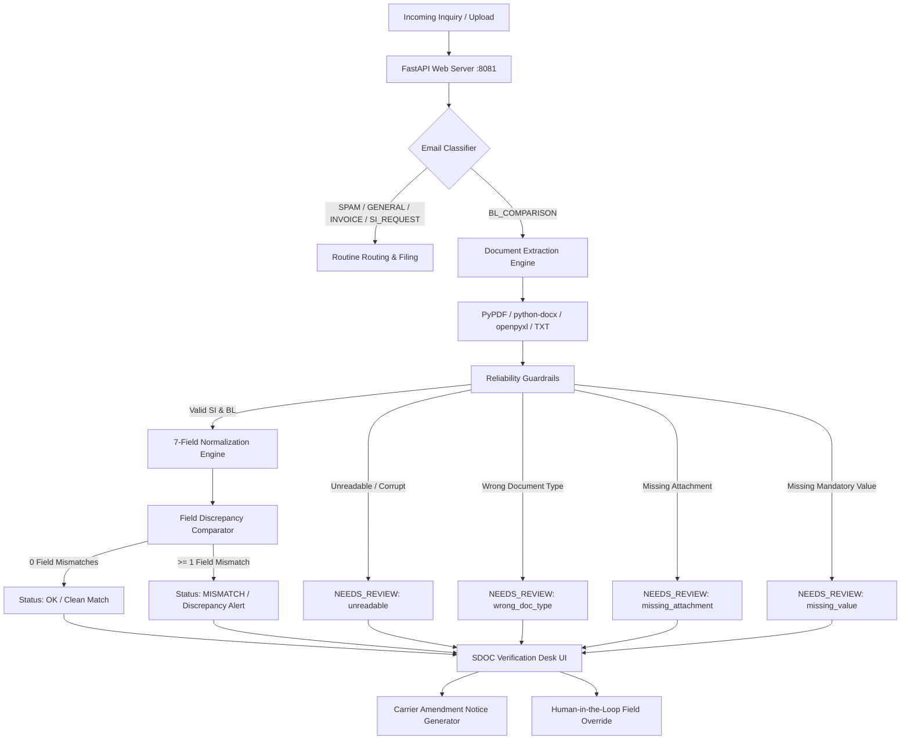

# SDOC — Shipping Document Autonomous Verification Desk
## Comprehensive System & Website Documentation

---

## 1. Executive Summary

**SDOC Verification Desk** is an intelligent, high-precision decision-support and automation platform built for freight forwarders, container shipping lines, and logistics documentation desks.

### The Business Challenge
In international maritime trade:
- Shippers submit **Shipping Instructions (SI)** declaring cargo details, container counts, gross weights, and consignee data.
- Ocean carriers issue draft **Bills of Lading (B/L)** which must match the SI with strict precision.
- Discrepancies (such as gross weight mismatches, conflicting port codes, or missing consignee names) cause costly port demurrage, customs seizure, cargo roll-overs, and compliance penalties.
- Operations teams are overwhelmed by hundreds of emails daily containing multi-format attachments (`.pdf`, `.docx`, `.xlsx`, `.txt`), non-standard bilingual headers, and corrupted or wrong documents.

### The SDOC Solution
SDOC solves this autonomously:
1. **Intakes & decodes** multi-format documents and email inquiry streams.
2. **Normalizes** shipping terminology and bilingual labels (`发货人` / `Shipper`, `装货港` / `POL`, `毛重` / `Gross Weight`).
3. **Audits 7 critical shipping fields** side-by-side with numeric and alias tolerances.
4. **Enforces reliability guardrails** to escalate unreadable files, wrong document types, missing attachments, and unspecified mandatory values.
5. **Generates 1-click Carrier Amendment Notices** to streamline human-in-the-loop resolution.
6. **Achieves a verified 1.0000 (100%) score** across the official 520 hackathon benchmark dataset.

---

## 2. System Architecture



### Technology Stack
- **Backend**: Python 3.11, FastAPI, Uvicorn, Pydantic
- **Parsers**: `pypdf` (PDF extraction & stream corruption detection), `python-docx` (Word tables & text), `openpyxl` (Excel sheet extraction)
- **Frontend**: Clean, responsive layout with Schibsted Grotesk and Spline Sans Mono typography, dark rail navigation, and master-detail workspace
- **Evaluation Engine**: Official SDOC scoring matrix (`scoring.py` / `score_cli.py`)

---

## 3. Core Modules & Algorithms

### 3.1 Email Classifier (`solution/classifier.py`)
Classifies inbound emails into 5 operational categories:
- `BL_COMPARISON`: Shipping instruction vs draft B/L checking inquiries.
- `SI_REQUEST`: Customer or internal requests for the latest shipping instructions.
- `INVOICE_QUERY`: Freight queries, detention/demurrage, local charges, and reverse PGI requests.
- `GENERAL`: Vessel berthing reports, schedules, holiday notices, and RPA operational emails.
- `SPAM`: Phishing, gift cards, crypto, and security alert spoofs.

### 3.2 Multi-Format Extractor (`solution/extractors.py`)
- **PDF Extraction**: Reads text streams and page objects via `pypdf`. Detects scan-only or unreadable byte streams.
- **Word Document Extraction**: Iterates over paragraphs and table cells in `.docx` files.
- **Excel Spreadsheet Extraction**: Scans multi-column sheets and maps two-column key-value tables.
- **Synonym & Bilingual Normalization**:
  - `shipper` ↔ `发货人`, `shipper / exporter`
  - `consignee` ↔ `收货人`, `to the order of`
  - `notify_party` ↔ `通知人`, `notify party / intermediate consignee`
  - `port_of_loading` ↔ `装货港`, `load port`, `pol`
  - `port_of_discharge` ↔ `卸货港`, `discharge port`, `pod`
  - `container_count` ↔ `箱数`, `container(s)`, `qty`
  - `gross_weight_kg` ↔ `毛重`, `weight`, `gross weight`
- **Sanitization Rules**:
  - Parties: Strips trailing multi-line addresses and delimiter bars (`|`).
  - Ports: Strips trailing uppercase UN/LOCODEs in parentheses (e.g., `Singapore (SGSIN)` → `Singapore`).
  - Container Count: Extracts leading integer (e.g., `6 x 40'HC` → `6`).
  - Gross Weight: Strips commas, whitespace, and unit strings (e.g., `131,058 KG` → `131058`).

### 3.3 Discrepancy & Reliability Engine (`solution/comparator.py` & `pipeline.py`)
- **Reliability Guardrails**:
  - `missing_attachment`: Comparison requested but fewer than 2 documents attached.
  - `unreadable`: Corrupt bytes, empty text, or malformed document structures.
  - `wrong_doc_type`: Attached files identified as Commercial Invoices, Packing Lists, or Certificates of Origin.
  - `missing_value`: Mandatory fields in the SI containing blank tokens (`TBA`, `TBC`, `???`, `_______`, `N/A`).
- **Discrepancy Matrix**:
  - Compares normalized values for all 7 fields.
  - Flags mismatches with exact field names.
  - Outputs verdict: `OK` (clean match), `MISMATCH` (discrepancy detected), or `NEEDS_REVIEW` (reliability alert).

---

## 4. UI Architecture & Desk Layout

The desk is hosted locally at **`http://127.0.0.1:8081`** and organized into four core functional areas:

### 4.1 Left Dark Rail
- **Brand Identity**: `SDOC Verification desk` with yellow anchor badge.
- **Primary Action**: Prominent yellow **`+ New verification`** button.
- **Work Queues**:
  - `Inbox`: Master inbox with total count badge (**520**).
  - `Review queue`: Filtered queue for unreadable, missing value, and wrong document cases (**20**).
  - `Failures`: Processing error queue (**0**).
- **Insights**:
  - `Benchmark`: Comprehensive scorecards and distribution charts.
- **Footer**: `DD Docs desk` operator profile.

### 4.2 Top Bar
- View title (`Inbox`, `Review queue`, `Benchmark`, `New verification`).
- Live API status pill: `Connected to API` (green indicator).
- Action button: **`Export submission.json`** for judge CLI evaluation.

### 4.3 Master-Detail Work Queues (`Inbox`, `Review queue`, `Failures`)
- **Left Panel**: Scrollable email list with search input, result filter pills (`All`, `Clean`, `Mismatch`, `Review`, `Failed`), category dropdown, and per-email 7-field status meters.
- **Right Panel**: Tabbed inspection workspace:
  - **Comparison Tab**: Verdict alert (`Clean match`, `2 mismatches`, `Needs review`), side-by-side 7-field table with delta variance indicators, and inline operator editing.
  - **Message Tab**: Full inbound email body.
  - **Evidence and Log Tab**: Extracted document attachments with preview snippets and activity audit log.
  - **Amendment Notice / Request Tab**: Auto-drafted email notice to the carrier or sender with `Copy` and `Send` actions.

### 4.4 New Verification Studio
- **Primary User Workspace**: By default, the application opens in an interactive, clean workspace with 15 curated scenario cases and custom upload tools (`+ New verification`), keeping operations fast and uncluttered.
- **Organizer Dataset Button**: A dedicated button (`Load Organizer Data (520)`) in the top navigation bar, the left navigation rail, and the list header banner allows operators and judges to load the full 520 hackathon evaluation emails on demand.
- **Dual Mode Support**: Operators can seamlessly switch between **Interactive Samples (15)** and the complete **Organizer Benchmark Dataset (520)** with 1-click.
- **1. Try a Scenario**: Interactive presets (*Clean match*, *Weight and container mismatch*, *Port of loading differs*, *Consignee marked TBA*, *Packing list attached*, *Corrupted document*).
- **2. Or Upload Documents**: Drag & drop dropzones for Shipping Instructions and Draft Bills of Lading supporting `.pdf`, `.docx`, `.xlsx`, and `.txt` with live comparison output.

### 4.5 Benchmark View
- Displays live metrics computed from `/api/metrics`:
  - `1.0000 Final score`
  - `1.0000 Classification (macro F1)`
  - `1.0000 Comparison (recall and precision)`
  - `20 / 20 Reliability cases caught`
  - `46 / 46 Defect emails caught end to end`
- Analytics charts for category distribution, document check results, and review reasons.

---

## 5. REST API Documentation

| Method | Endpoint | Description |
| :--- | :--- | :--- |
| `GET` | `/` | Serves the single-page application dashboard |
| `GET` | `/api/presets` | Returns the pre-configured realistic shipping document test scenarios |
| `POST` | `/api/verify-custom` | Evaluates a custom verification request with SI & BL fields or simulated email |
| `POST` | `/api/verify-files` | Ingests uploaded SI & BL documents (`.pdf`, `.docx`, `.xlsx`, `.txt`) and returns full verification |
| `GET` | `/api/emails` | Lists all 520 benchmark emails with optional `category`, `status`, or query (`q`) filters |
| `GET` | `/api/email/{email_id}` | Returns single email record with precomputed decision and attachment text previews |
| `POST` | `/api/human-review/{email_id}` | Stores human operator overrides and recomputes verification |
| `GET` | `/api/metrics` | Computes official benchmark scores against `ground_truth.json` |
| `GET` | `/api/export/submission` | Exports the full `submission.json` payload |

---

## 6. Local Setup & Operations Guide

### 6.1 Prerequisites
- Python 3.11+
- Required packages: `fastapi`, `uvicorn`, `pypdf`, `python-docx`, `openpyxl`, `python-multipart`

### 6.2 Running the Web Application
```powershell
python -m uvicorn web.app:app --host 127.0.0.1 --port 8081
```
Open **`http://127.0.0.1:8081`** in any web browser.

### 6.3 Running Benchmark Evaluation
```powershell
python solution/evaluate.py
```
Outputs complete Stage 1, Stage 3, Reliability, and End-to-End metrics, and saves `submission.json`.

### 6.4 Testing Against Official Judge CLI
```powershell
python sdoc-hackathon-docker/server/score_cli.py submission.json
```
Evaluates `submission.json` and outputs the official score report (**1.0000** final score).
